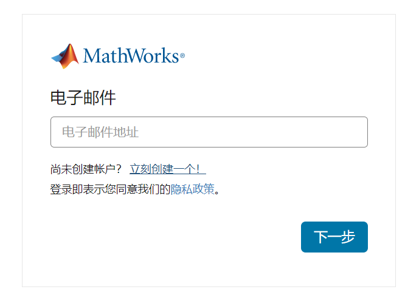
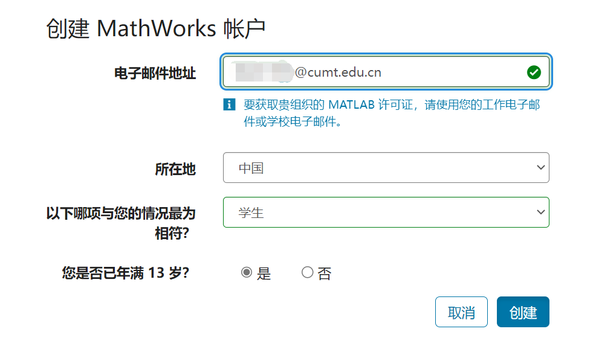
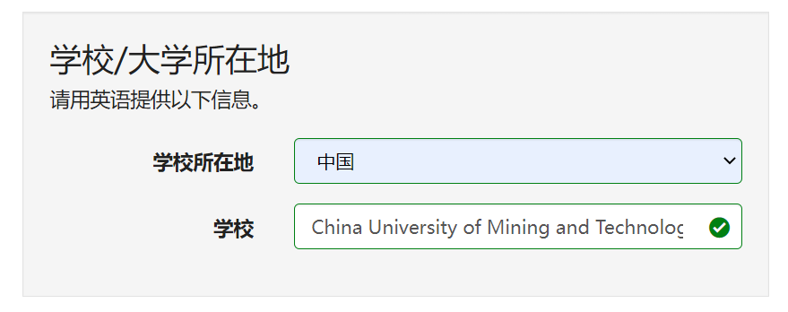
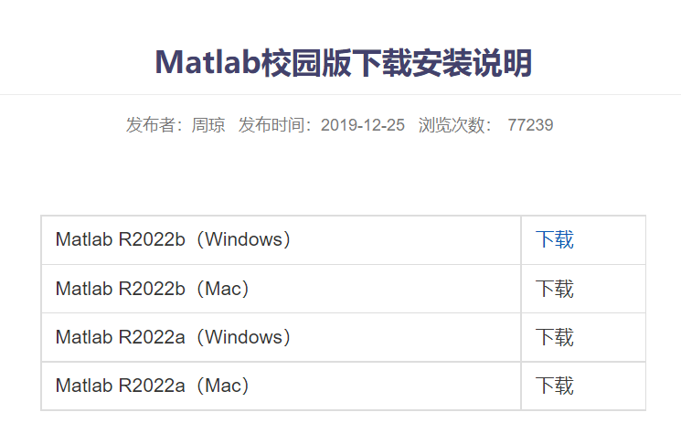
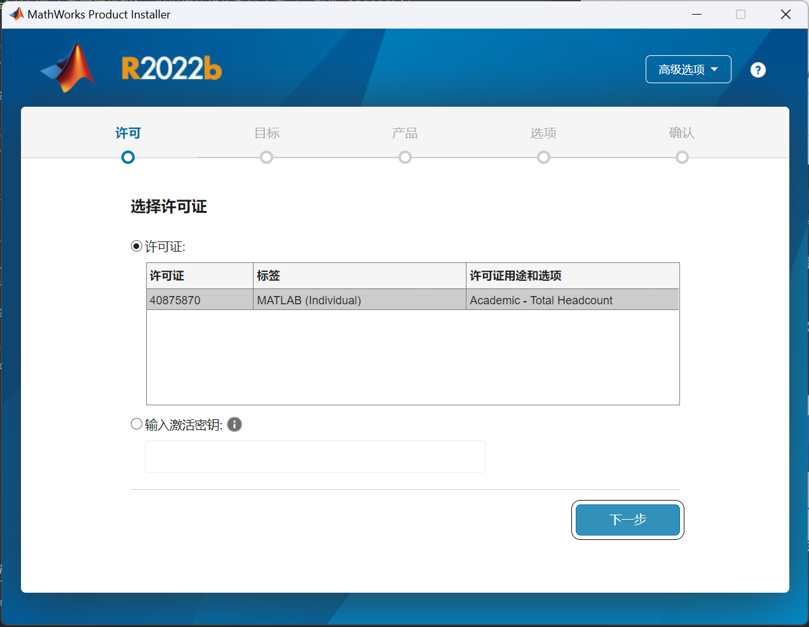
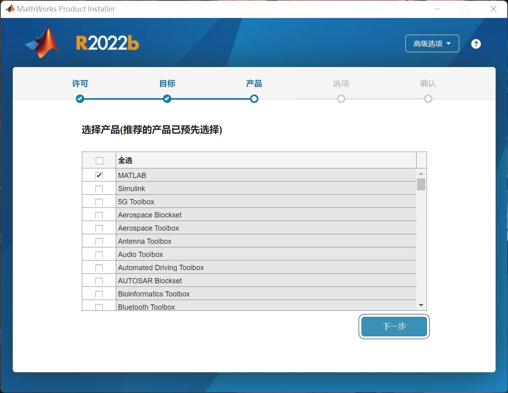

# 中国矿业大学 MATLAB 安装教程

## 注册 MATLAB 账号

访问网站 cn.mathworks.com/login 注册一个账号（点击 `立即创建一个`）

其中**电子邮件地址**填写你的**矿大邮箱地址**，默认格式为 `你的学号@cumt.edu.cn`（必须为矿大邮箱，否则就要自己买正版）

点击 `创建`，MATLAB会往你的矿大邮件发送一份确认邮件

访问矿大邮箱官网 mail.cumt.edu.cn，登录方式如下：

- 方式1：使用邮箱用户名、密码登录，用户名为学号（或已设置的别名），初始密码为 `Kdyx@身份证后六位`

- 方式2：使用校统一身份认证登录邮箱

- 方式3：如已绑定微信，在邮箱登录界面，可通过微信扫码登录邮箱

- 如果上述方法都不行建议点击 `忘记密码` 然后重置密码

查看收件箱，点击 `验证电子邮件`

进入后如实填写你的个人信息，其中学校信息一栏须填写矿大的英文名 `China University of Mining and Technology`

最后接受协议并创建即可

## 下载 MATLAB（以Windows系统为例）

访问矿大官网 www.cumt.edu.cn，滑倒最底下选择 `正版软件`，选择 `MATLAB` -> `Matlab校园版下载安装说明`，根据你的操作系统下载（一般选 `R2022b`）

或者直接访问网站 http://gsoft.cumt.edu.cn/7a/ad/c19003a555693/page.htm 根据你的操作系统下载（一般选 `R2022b`）

下载完成后找到下载的文件 `R2022b_Windows.iso` 双击打开（不知道下载到哪的在浏览器下载目录里对应的文件旁边点 `打开文件夹`）

打开 `setup.exe` 进行安装，登录使用刚刚在MATLAB官网注册的账号登录（邮箱为矿大邮箱，密码为你设置的密码）

选择许可证不要选择密钥（除非你有）

选择你的安装目录，然后遇到以下界面选择产品

根据需求选择产品（可见官网说明 <https://ww2.mathworks.cn/help>），其中 `MATLAB` 为必选，若磁盘空间较大，建议选上 `Simulink`

点击下一步安装即可
